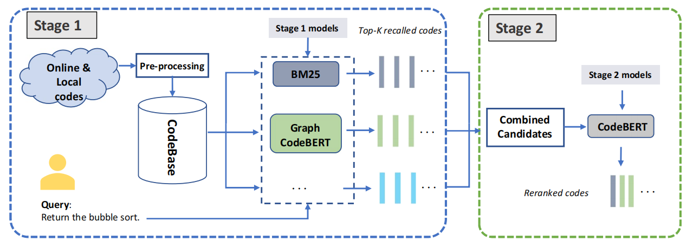

# Revisiting code search in a two-stage paradigm

[WSDM 2023] This is the official PyTorch implementation for the paper: ["Revisiting Code Search in a Two-Stage Paradigm"](https://dl.acm.org/doi/abs/10.1145/3539597.3570383) ([arXiv url](https://arxiv.org/abs/2208.11274)). This project implements two-stage paradigm on CodeSearchNet. 



## Environment

We used Anaconda to setup a deep learning workspace that supports PyTorch. Run the following script to install all the required packages.

```sh
conda create -n TwoStage python==3.8
conda activate TwoStage

download this_project

cd TwoStage
pip install -r requirements.txt
pip install git+https://github.com/casics/spiral.git
```


## Data prepare

### Dataset

We follow [GraphCodeBERT](https://github.com/microsoft/CodeBERT/tree/master/GraphCodeBERT/codesearch) pre-process progress for CodeSearchNet. The answer of each query is retrieved from the whole development and testing code corpus instead of 1,000 candidate codes. We put the dataset files on `~/VisualSearch/GraphCodeBERT_dataset`.

```sh
mkdir ~/VisualSearch
mkdir ~/VisualSearch/GraphCodeBERT_dataset
```

Please refer to GraphCodeBERT for data-preprocess: https://github.com/microsoft/CodeBERT/tree/master/GraphCodeBERT/codesearch#data-preprocess


### Model checkpoints

Except for text matching methods, the other baselines need checkpoints for model weight initialization. Readers could train the baselines referring to the URLs provided in the paper and put the checkpoint files to `~/VisualSearch/TwoStageModels/`. We provide the checkpoints of GraphCodeBERT and CodeBERT on python subset.

GoogleDrive: https://drive.google.com/file/d/1Tfhibit35WzfLEyl0Uf5hGsi5FSIMwna/view?usp=sharing

```sh
unzip -q "TwoStageModels.zip" -d "~/VisualSearch/"
```


#### Train model from scratch

If you want to Train GraphCodeBERT, CodeBERT and CODEnn from scratch, you could refer to the following instrctions.

For GraphCodeBERT, we could refer to the official implement: https://github.com/microsoft/CodeBERT/tree/master/GraphCodeBERT/codesearch#data-preprocess.

However, for CodeBERT and CODEnn, due to the differences in dataset preprocessing and partitioning methods used here compared to the official implementation, you can use our provided training scripts:

- CodeBERT: `./shell/TOSS/train_CodeBert_csn.sh`
- CODEnn: `./shell/TOSS/train_CODEnn_csn.sh`


## Two-stage evaluation on python subset

The evaluation results of $TOSS_{[BM25]+CodeBERT}$, $TOSS_{[GraphCodeBERT]+CodeBERT}$, and $TOSS_{[GraphCodeBERT+BM25]+CodeBERT}$.

```sh
language="python"

python run.py --lang ${language} --num_workers 16 --device cuda --code_length 256 --batch_size 256
```

On one V100 GPU, we get following results:


**MRR**:

| Model                                  | Top 5      | Top 10     | Top 100    |
| -------------------------------------- | ---------- | ---------- | ---------- |
| $TOSS_{[BM25]+CodeBERT}$               | 0.5428     | 0.5852     | 0.6884     |
| $TOSS_{[GraphCodeBERT]+CodeBERT}$      | 0.7392     | 0.7512     | 0.7589     |
| $TOSS_{[GraphCodeBert+BM25]+CodeBERT}$ | **0.7553** | **0.7595** | **0.7607** |

**Per Query Time (seconds)**:

| Model                                  | Top 5   | Top 10  | Top 100  |
| -------------------------------------- | ------- | ------- | -------- |
| $TOSS_{[BM25]+CodeBERT}$               | 7.6     | 12.5    | 114.3    |
| $TOSS_{[GraphCodeBERT]+CodeBERT}$      | 54.0    | 59.2    | 161.1    |
| $TOSS_{[GraphCodeBert+BM25]+CodeBERT}$ | 61.2801 | 72.3974 | 277.8994 |


## Two-stage evaluation on six language of CSN

After preparing the Model checkpoints of GraphCodeBERT and CodeBERT on Ruby, JavaScript, Go, Python, Java, and PHP, we get the MRR and Recall result.

**MRR**

| Model / Method | Ruby      | Javascript | Go        | Python    | Java      | Php       | Overall   |
| -------------- | --------- | ---------- | --------- | --------- | --------- | --------- | --------- |
| BOW            | 0.230     | 0.184      | 0.350     | 0.222     | 0.245     | 0.193     | 0.237     |
| TF             | 0.239     | 0.204      | 0.363     | 0.240     | 0.262     | 0.215     | 0.254     |
| Jaccard        | 0.220     | 0.191      | 0.345     | 0.243     | 0.235     | 0.182     | 0.236     |
| BM25           | 0.505     | 0.393      | 0.572     | 0.452     | 0.426     | 0.335     | 0.447     |
| CODEnn         | 0.342     | 0.355      | 0.495     | 0.178     | 0.108     | 0.141     | 0.270     |
| CodeBERT-bi    | 0.679     | 0.620      | 0.882     | 0.667     | 0.676     | 0.628     | 0.692     |
| GraphCodeBERT  | 0.703     | 0.644      | 0.897     | 0.692     | 0.691     | 0.649     | 0.713     |
| $TOSS$         | **0.765** | **0.696**  | **0.918** | **0.760** | **0.750** | **0.692** | **0.763** |


**R@1**

| R@1            |          |            |          |          |          |          |          |
| -------------- | -------- | ---------- | -------- | -------- | -------- | -------- | -------- |
| Model / Method | Ruby     | Javascript | Go       | Python   | Java     | Php      | Overall  |
| BOW            | 15.2     | 12.3       | 26.1     | 17.7     | 17.0     | 13.2     | 16.9     |
| TF             | 15.2     | 13.7       | 26.7     | 16.1     | 18.1     | 14.9     | 17.4     |
| Jaccard        | 14.2     | 12.9       | 25.6     | 16.9     | 15.9     | 11.7     | 16.2     |
| BM25           | 39.7     | 29.2       | 45.7     | 35.6     | 32.0     | 23.9     | 34.4     |
| CodeBERT-bi    | 55.7     | 49.1       | 83.2     | 57.4     | 56.0     | 50.4     | 58.6     |
| GraphCodeBERT  | 60.7     | 54.7       | 85.0     | 59.3     | 59.0     | 54.6     | 62.2     |
| **TOSS**       | **67.9** | **60.4**   | **87.4** | **67.0** | **66.1** | **58.6** | **67.9** |

**R@5**

| Model / Method | Ruby     | Javascript | Go       | Python   | Java     | Php      | Overall  |
| -------------- | -------- | ---------- | -------- | -------- | -------- | -------- | -------- |
| BOW            | 30.5     | 24.2       | 44.2     | 30.7     | 32.0     | 25.3     | 31.1     |
| TF             | 32.5     | 26.6       | 46.5     | 28.1     | 34.5     | 27.8     | 32.7     |
| Jaccard        | 30.3     | 24.9       | 44.1     | 30.8     | 31.1     | 24.1     | 30.9     |
| BM25           | 63.2     | 51.0       | 71.0     | 56.4     | 54.8     | 44.2     | 56.8     |
| CodeBERT-bi    | 79.3     | 72.3       | 94.7     | 77.9     | 78.4     | 73.8     | 79.4     |
| GraphCodeBERT  | 83.1     | 76.5       | 95.7     | 82.1     | 81.0     | 77.5     | 82.7     |
| **TOSS**       | **86.0** | **79.6**   | **96.3** | **85.6** | **83.9** | **79.4** | **85.1** |


**R@10**

| Model / Method | Ruby     | Javascript | Go       | Python   | Java     | Php      | Overall  |
| -------------- | -------- | ---------- | -------- | -------- | -------- | -------- | -------- |
| BOW            | 37.5     | 30.2       | 51.5     | 36.7     | 38.3     | 31.1     | 37.6     |
| TF             | 40.5     | 33.3       | 54.3     | 33.6     | 41.6     | 34.2     | 39.6     |
| Jaccard        | 38.9     | 31.8       | 51.3     | 37.1     | 38.1     | 30.6     | 38.0     |
| BM25           | 70.9     | 58.5       | 78.5     | 63.4     | 62.4     | 51.8     | 64.3     |
| CodeBERT-bi    | 85.6     | 78.6       | 96.8     | 83.3     | 83.8     | 80.8     | 84.8     |
| GraphCodeBERT  | 87.5     | 82.8       | 97.4     | 87.3     | 86.2     | 83.9     | 87.5     |
| **TOSS**       | **87.5** | **81.4**   | **96.7** | **87.4** | **85.0** | **81.3** | **86.5** |

## Implement tips


### Code structure

- `StageClass.py` includes the implements of two-stage framework and each model.
- `evaluation.py` includes evaluation function (MRR, Recall@K and Time).


### Add your first-stage model

You just need to add a class in `StageClass.py`. The templet is as following:

```python
class YourFirstStageModel(BaseStageCodeSearch):
    def __init__(self, dataset="GraphCodeBERT_python", code_pre_process_config=[],
                 query_pre_process_config=[], args=None):
        ...
        
    def get_time_score(self, topK):
        """
        return score_matrix, index, calculate_time
        """
        ...
```


### Add your second-stage model

You just need to add a class in `StageClass.py`. The templet is as following:

```python
class YourSecondStageModel(BaseStageCodeSearch):
    def __init__(self, dataset="GraphCodeBERT_python", code_pre_process_config=[],
                 query_pre_process_config=[], args=None):
        ...
        
    def evaluation_two_stage(self, topK, score_stage1, index_stage1, stage1_time):
        ...
```


Please feel free to contact us after the project is open.

```
@inproceedings{hu2023revisiting,
  title={Revisiting Code Search in a Two-Stage Paradigm},
  author={Hu, Fan and Wang, Yanlin and Du, Lun and Li, Xirong and Zhang, Hongyu and Han, Shi and Zhang, Dongmei},
  booktitle={WSDM},
  pages={994--1002},
  year={2023}
}
```

## Contact

If you enounter any issue when running the code, please feel free to reach us either by creating a new issue in the github or by emailing

- Fan Hu ([hufan_hf@ruc.edu.cn](mailto:hufan_hf@ruc.edu.cn))
- Yanlin Wang  (wangylin36@mail.sysu.edu.cn)
